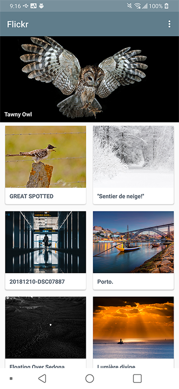
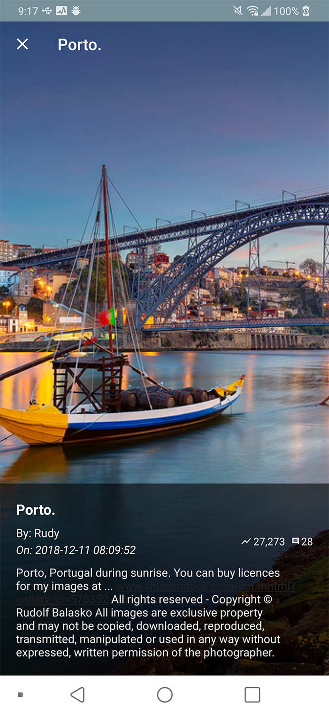

## Flickr example

This sample used Retrofit and Coroutines.
The Android HttpsURLConnection and Coroutines samples can be found on the [link](https://github.com/taehwandev/FlickrExample/tree/back_https_request_custom).

The used library is as follows.

## Use library

- [Retrofit](https://square.github.io/retrofit/)
- [Android Architecture Components ViewModel](https://developer.android.com/topic/libraries/architecture/adding-components)
- [DataBinding](https://developer.android.com/topic/libraries/data-binding/)
- [LifecycleExtensions](https://thdev.tech/LifecycleExtensions/)
- [CoroutinesUIExtensions](https://thdev.tech/CoroutinesUIExtensions/)
- [Glide](https://github.com/bumptech/glide)
- [Lottie android](https://github.com/airbnb/lottie-android)
- [GSon](https://github.com/google/gson)

## Image




## License

```
Copyright 2018 Tae-hwan

Licensed under the Apache License, Version 2.0 (the "License");
you may not use this file except in compliance with the License.
You may obtain a copy of the License at

   http://www.apache.org/licenses/LICENSE-2.0

Unless required by applicable law or agreed to in writing, software
distributed under the License is distributed on an "AS IS" BASIS,
WITHOUT WARRANTIES OR CONDITIONS OF ANY KIND, either express or implied.
See the License for the specific language governing permissions and
limitations under the License.
```